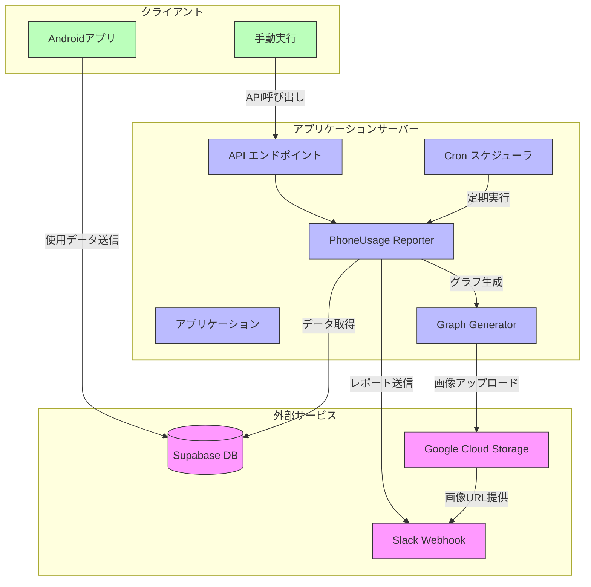

# スマホ使用時間Slack通知アプリ

スマホの使用時間データをSupabaseから取得し、週間レポートとしてSlackに定期通知するサービスです。




## 機能

- Supabaseに保存されたスマホ使用状況データを分析
- 週間使用時間の折れ線グラフを生成
- よく使うアプリのランキングを円グラフで視覚化
- 前週との使用時間比較
- 定期的にSlackチャンネルにレポートを投稿
- 個別ユーザーまたは全ユーザーへの手動レポート送信機能

## 要件

- Node.js 16.x以上
- npm または yarn
- Supabase アカウントとプロジェクト
- Slack Webhook URL

## デプロイ

### 0. リポジトリのクローン

```bash
git clone https://github.com/yourusername/phone-usage-slack-reporter.git
cd phone-usage-slack-reporter
```

### 1. 環境変数の設定

`.env` ファイルを作成し、必要な環境変数を設定します。

```bash
# .env.example ファイルをコピーして作成
cp .env.example .env

# .env ファイルを編集
nano .env
```

`.env` ファイルには以下の項目を必ず設定してください：

- `PORT`: アプリケーションのポート番号（デフォルト: 4600）
- `API_KEY`: API アクセス用のセキュアなキー
- `SUPABASE_URL`: Supabase プロジェクト URL
- `SUPABASE_SERVICE_KEY`: Supabase サービスキー
- `SLACK_WEBHOOK_URL`: Slack 通知用の Webhook URL
- `CRON_SCHEDULE`: 週間レポートのスケジュール（cron形式、デフォルト: `0 9 * * 1`）
- `HOURLY_CRON_SCHEDULE`: 毎時レポートのスケジュール（cron形式、デフォルト: `0 * * * *`）

### 2. Docker イメージのビルドとコンテナの起動

```bash
# Docker イメージのビルドと起動
docker-compose up -d --build

# ログの確認
docker-compose logs -f
```

### 3. 動作確認

アプリケーションが正常に起動したことを確認します：

```bash
# ヘルスチェックエンドポイントへのアクセス
curl http://localhost:4600/health

# テスト週間レポートの送信（APIキーが必要）
curl -X POST http://localhost:4600/api/test-report \
  -H "Authorization: Bearer YOUR_API_KEY" \
  -H "Content-Type: application/json" \
  -d '{"userId": "test-user"}'

# テスト毎時レポートの送信（APIキーが必要）
curl -X POST http://localhost:4600/api/test-hourly-report \
  -H "Authorization: Bearer YOUR_API_KEY" \
  -H "Content-Type: application/json" \
  -d '{"userId": "test-user"}'
```

## 新機能：毎時レポート

アプリケーションに新しく追加された毎時レポート機能について説明します。

### 毎時レポートの内容

毎時レポートは以下の情報を提供します：

1. 現在の時間帯の使用状況
2. 前の時間帯との使用時間比較
3. 今日の累積使用時間と昨日の同時刻との比較
4. 過去6時間の使用傾向グラフ
5. 現在の時間帯で最も使用されたアプリのリスト

### スケジュール設定

毎時レポートは以下の方法でスケジュールされます：

1. デフォルトでは毎時0分（`0 * * * *`）に実行されます
2. カスタムスケジュールを設定するには、`.env` ファイルの `HOURLY_CRON_SCHEDULE` 変数を変更します

### 手動実行

必要に応じて、APIエンドポイントから手動で毎時レポートをトリガーできます：

```bash
# 全ユーザーの毎時レポートを手動実行
curl -X POST http://localhost:4600/api/trigger-hourly-reports \
  -H "Authorization: Bearer YOUR_API_KEY"

# 特定ユーザーの毎時レポートをテスト
curl -X POST http://localhost:4600/api/test-hourly-report \
  -H "Authorization: Bearer YOUR_API_KEY" \
  -H "Content-Type: application/json" \
  -d '{"userId": "your-user-id"}'
```

## 運用ガイド

### コンテナの管理

```bash
# コンテナの停止
docker-compose stop

# コンテナの再起動
docker-compose restart

# コンテナとネットワークの削除（データは保持）
docker-compose down

# コンテナ、ネットワーク、ボリュームの完全削除
docker-compose down -v
```

### ログの確認

```bash
# コンテナのログを表示
docker-compose logs -f

# 特定行数のログを表示
docker-compose logs --tail=100
```

### 設定の更新

環境変数や設定を変更した場合は、コンテナの再ビルドが必要です：

```bash
# 環境変数を変更後、再ビルドして再起動
docker-compose up -d --build
```

### バックアップ

ログとデータのバックアップを定期的に行うことをお勧めします：

```bash
# ログディレクトリのバックアップ
tar -czvf phone_usage_logs_$(date +%Y%m%d).tar.gz ./logs
```

## トラブルシューティング

### コンテナが起動しない場合

1. ログを確認します：
   ```bash
   docker-compose logs
   ```

2. 環境変数が正しく設定されているか確認します：
   ```bash
   docker-compose config
   ```

3. ポートの競合がないか確認します：
   ```bash
   netstat -tulpn | grep 4600
   ```

### レポートが生成されない場合

1. cronスケジュールが正しく設定されているか確認します
2. ログでエラーメッセージを確認します
3. テストエンドポイントを使用して手動でレポート生成をテストします
4. Supabaseデータベースに正しいデータが存在するか確認します

### グラフ生成エラー

canvas関連のエラーが発生した場合は、Dockerイメージに必要な依存関係がインストールされているか確認してください：

```bash
# コンテナに入って依存関係を確認
docker-compose exec app sh
apk info | grep cairo
apk info | grep pango
```

## セキュリティに関する注意事項

- 本番環境では必ず強力な `API_KEY` を設定してください
- `.env` ファイルをバージョン管理システムにコミットしないでください
- Supabase のサービスキーは厳重に管理してください
- コンテナ内では非特権ユーザーでアプリケーションを実行しています
## Supabaseデータベース構造

`phone_usage`テーブルの構造：

```sql
create table public.phone_usage (
  id serial primary key,
  user_id text not null,
  date date not null,
  total_usage_time integer not null,
  app_usage jsonb not null,
  created_at timestamp with time zone default now()
);

-- インデックス
create index idx_phone_usage_user_id on public.phone_usage(user_id);
create index idx_phone_usage_date on public.phone_usage(date);
```

## スマホアプリのデータ形式

Androidアプリからのデータ送信形式の例：

```json
{
  "user_id": "user123",
  "date": "2025-04-03",
  "total_usage_time": 180,
  "app_usage": {
    "Twitter": 45,
    "Instagram": 30,
    "Chrome": 25,
    "YouTube": 40,
    "LINE": 20,
    "その他": 20
  }
}
```

## カスタマイズ

- `src/reporters/phoneUsageReporter.ts`: レポート生成やグラフのカスタマイズ
- `src/config.ts`: アプリケーション設定の調整
- Slackメッセージのフォーマットを変更するには`sendSlackMessage`メソッドを編集

## ライセンス

MIT