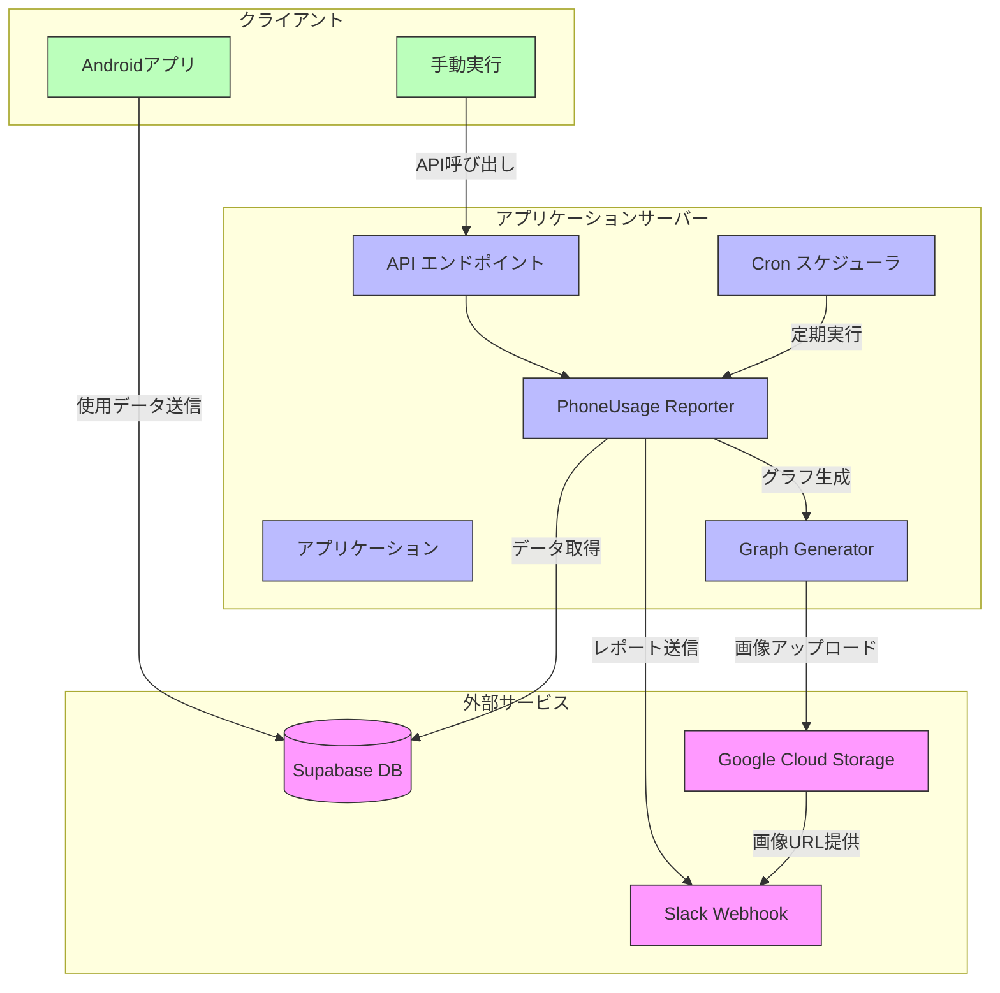

# スマホ使用時間Slack通知アプリ

スマホの使用時間データをSupabaseから取得し、週間レポートとしてSlackに定期通知するサービスです。




## 機能

- Supabaseに保存されたスマホ使用状況データを分析
- 週間使用時間の折れ線グラフを生成
- よく使うアプリのランキングを円グラフで視覚化
- 前週との使用時間比較
- 定期的にSlackチャンネルにレポートを投稿
- 個別ユーザーまたは全ユーザーへの手動レポート送信機能

## 要件

- Node.js 16.x以上
- npm または yarn
- Supabase アカウントとプロジェクト
- Slack Webhook URL
- Google Cloud Storage（グラフ画像の保存用）

## セットアップ

### 1. リポジトリのクローン

```bash
git clone https://github.com/yourusername/phone-usage-slack-reporter.git
cd phone-usage-slack-reporter
```

### 2. 依存パッケージのインストール

```bash
npm install
```

### 3. 環境変数の設定

`.env`ファイルを作成し、必要な環境変数を設定します：

```
# アプリ設定
PORT=3000
API_KEY=your-secure-api-key
CRON_SCHEDULE=0 9 * * 1
LOG_LEVEL=info

# Supabase設定
SUPABASE_URL=https://your-project.supabase.co
SUPABASE_SERVICE_KEY=your-service-key

# Slack設定
SLACK_WEBHOOK_URL=https://hooks.slack.com/services/XXXX/YYYY/ZZZZ

# Google Cloud Storage設定
GCP_PROJECT_ID=your-gcp-project-id
GCP_STORAGE_BUCKET=your-storage-bucket
GCP_KEY_FILE=./google-credentials.json
```

### 4. Google Cloud Storageの設定

1. Google Cloud Consoleでサービスアカウントを作成
2. サービスアカウントキーをJSONファイルとしてダウンロード
3. ダウンロードしたJSONファイルを`google-credentials.json`として保存

### 5. ビルドと起動

```bash
# TypeScriptのコンパイル
npm run build

# アプリケーションの起動
npm start
```

## Dockerでの実行

```bash
# Dockerイメージのビルド
docker-compose build

# コンテナの起動
docker-compose up -d
```

## API仕様

### 手動でレポートを送信

```
POST /api/report
```

ヘッダー:
```
x-api-key: your-api-key
```

リクエストボディ:
```json
{
  "userId": "user123"
}
```

### 全ユーザーにレポートを送信

```
POST /api/report-all
```

ヘッダー:
```
x-api-key: your-api-key
```

## Supabaseデータベース構造

`phone_usage`テーブルの構造：

```sql
create table public.phone_usage (
  id serial primary key,
  user_id text not null,
  date date not null,
  total_usage_time integer not null,
  app_usage jsonb not null,
  created_at timestamp with time zone default now()
);

-- インデックス
create index idx_phone_usage_user_id on public.phone_usage(user_id);
create index idx_phone_usage_date on public.phone_usage(date);
```

## スマホアプリのデータ形式

Androidアプリからのデータ送信形式の例：

```json
{
  "user_id": "user123",
  "date": "2025-04-03",
  "total_usage_time": 180,
  "app_usage": {
    "Twitter": 45,
    "Instagram": 30,
    "Chrome": 25,
    "YouTube": 40,
    "LINE": 20,
    "その他": 20
  }
}
```

## カスタマイズ

- `src/reporters/phoneUsageReporter.ts`: レポート生成やグラフのカスタマイズ
- `src/config.ts`: アプリケーション設定の調整
- Slackメッセージのフォーマットを変更するには`sendSlackMessage`メソッドを編集

## ライセンス

MIT